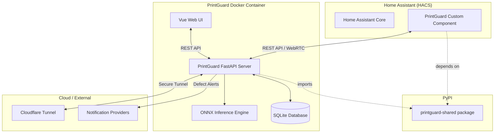

# Architecture

PrintGuard is designed with a decoupled architecture that separates the core failure detection logic, the API server, and the integration clients.

## System Overview

PrintGuard consists of three main parts:

1.  **PrintGuard Server (`printguard`)**: The main application, distributed as a Docker container. It handles the WebUI, API, video processing, and ML inference.
2.  **PrintGuard Shared Library (`printguard-shared`)**: A lightweight Python library published to PyPI. It contains shared cryptography and data models used by both the server and the Home Assistant integration.
3.  **Home Assistant Integration**: A custom component for Home Assistant that allows monitoring and controlling your printers directly from your smart home dashboard.

## Data Flow Diagram

## Package Split Logic

We split the codebase into `printguard` and `printguard-shared` for several reasons:

- **Home Assistant Compliance**: Home Assistant custom components must specify their dependencies in a `manifest.json`. These dependencies must be available on PyPI. By publishing `printguard-shared`, the HA integration can securely handle encryption/decryption without needing the entire server package.
- **Security**: Critical cryptographic logic (used for M2M authentication) is centralized in the shared library, ensuring consistency across different clients.
- **Environment Isolation**: The main server requires heavy ML dependencies (PyTorch, ONNX). By keeping the shared library minimal, we avoid forcing Home Assistant to install large AI libraries.

## Core Services

- **Coordinator**: Manages the state of all printers and ensures camera feeds are active.
- **Inference Service**: Handles the queuing and processing of frames through the detection model.
- **Defect Handler**: Processes detection results and triggers configured actions (pausing prints, sending notifications).
- **Tunnel Manager**: Manages the lifecycle of Cloudflare or ngrok tunnels for remote access.
