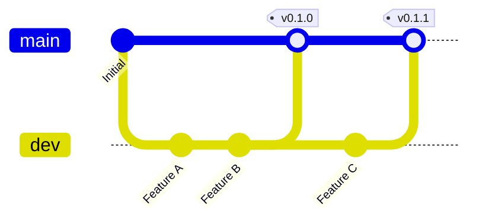

# Contributing

Thank you for your interest in contributing to PrintGuard! We follow a branching strategy designed to keep the stable release branch clean while allowing rapid development.

## Guidelines

- **Keep it local**: Avoid adding features that require external cloud services unless absolutely necessary.
- **Maintain performance**: PrintGuard is designed for edge devices. Keep ML models and processing overhead in mind.
- **Style**: We use `ruff` for linting. Please ensure your code passes the lint checks before submitting a PR.

## Development Workflow

We use a standard `Feature -> dev -> main` branching model:



### 1. Active Development (`dev` branch)
The `dev` branch is where all active development happens. 
- All Pull Requests should be targeted at the `dev` branch.
- Every push to `dev` triggers a **CI check** and builds a **Development Docker Image**.
- You can test the latest development features by pulling the `dev` tag:
  ```bash
  docker pull ghcr.io/oliverbravery/printguard:dev
  ```

### 2. Stable Releases (`main` branch)
The `main` branch always contains the code for the latest stable release.
- Code is merged from `dev` to `main` when a new release is ready.
- **The version in `pyproject.toml` is the source of truth for releases.**

## Validation (CI)

Our CI workflow runs on every push and Pull Request to **both** `dev` and `main`. It performs:
- **Linting**: Style checks using `ruff`.
- **Package Build**: Verifies the `printguard-shared` package build.
- **Docker Build**: A dry-run build of the Docker image to ensure no regressions.

## Release Process (Automated)

We use an automated release process triggered by version changes in the root `pyproject.toml`.

1.  **Prepare Release**: On the `dev` branch, update the version in `pyproject.toml` (e.g., from `0.1.0` to `0.1.1`). 
    *Note: Ensure `printguard-shared/pyproject.toml` is also updated to the same version.*
2.  **Merge to main**: Open a Pull Request to merge `dev` into `main`.
3.  **Automatic Release**: Once merged into `main`, a GitHub Action will:
    - Check if a Git tag for the new version already exists.
    - If it's a new version, it will automatically:
        - Create a new Git tag (e.g., `v0.1.1`).
        - Create a GitHub Release with automated changelog notes.
        - Build and push the official Docker image to GHCR with the version tag and `:latest`.
        - Build and publish the `printguard-shared` library to PyPI.
        - Update the documentation site.

By simply updating the version number in your code and merging to `main`, the entire distribution pipeline is handled for you.
